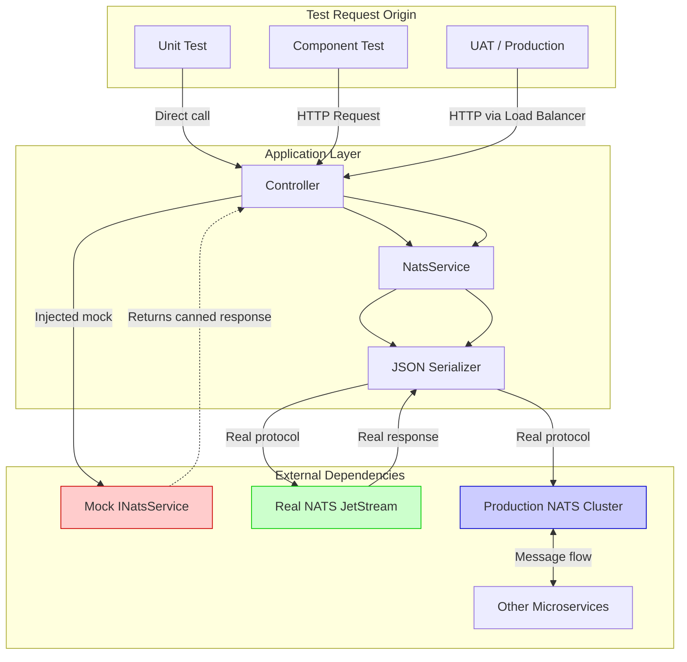

# NatsHttpGateway Component Tests

## Table of Contents

- [Why Component Tests?](#why-component-tests)
- [Testing Levels Explained](#testing-levels-explained)
- [Execution Flow Comparison](#execution-flow-comparison)
- [How Component Tests Work](#how-component-tests-work)
- [Running Component Tests](#running-component-tests)
- [Adding New Component Tests](#adding-new-component-tests)
  - [Common Pitfalls](#common-pitfalls)
  - [Test Priority Matrix](#test-priority-matrix)
- [Code Coverage Strategy](#code-coverage-strategy)

---

## Why Component Tests?

Component tests fill a critical gap between unit tests and UAT that neither can address effectively.

### The Testing Gap Problem

A unit test for `MessagesController` mocks `INatsService` and verifies that when `PublishAsync` returns success, the controller returns HTTP 200. The test passes. But in production, the application fails because:

- The JSON serialization format doesn't match what NATS expects
- The JetStream stream configuration assumptions were wrong
- The consumer acknowledgment behavior differs from the mock

**Unit tests verify our code works *if external dependencies behave as we assume*. Component tests verify those assumptions are correct.**

### What Each Test Level Catches

| Issue Type | Unit Tests | Component Tests | UAT |
|------------|:----------:|:---------------:|:---:|
| Logic errors in controller code | ✅ | ✅ | ✅ |
| Incorrect mock assumptions | ❌ | ✅ | ✅ |
| NATS protocol/serialization issues | ❌ | ✅ | ✅ |
| JetStream configuration problems | ❌ | ✅ | ✅ |
| JWT authentication enforcement | ✅ | ✅ | ✅ |
| mTLS certificate configuration | ❌ | ✅ | ✅ |
| Infrastructure/network issues | ❌ | ❌ | ✅ |
| Cross-service integration | ❌ | ❌ | ✅ |
| Business workflow validation | ❌ | ❌ | ✅ |

### Why Not Just Use UAT?

UAT tests are slow (minutes), expensive (full environment), and flaky (network issues). Component tests provide **fast, reliable feedback** (seconds) while catching the same integration issues.

---

## Testing Levels Explained

### Unit Tests (`NatsHttpGateway.Tests`)

- Mock all external dependencies
- Run in milliseconds
- Test edge cases and error handling extensively
- **Example**: Verify `MessagesController.Publish()` returns BadRequest when message_id is empty

### Component Tests (`NatsHttpGateway.ComponentTests`)

- Use real NATS JetStream server
- Test the full request/response cycle
- Verify serialization, protocol handling, and configuration
- Run in seconds
- **Example**: Publish a message via the API, verify it exists in NATS

### UAT (User Acceptance Testing)

- Full deployment with all services
- Tests business workflows end-to-end
- Validates non-functional requirements
- **Example**: Verify payment message flows through gateway to payment service

---

## Execution Flow Comparison



### What Gets Tested at Each Level

```mermaid
flowchart LR
    subgraph Unit["Unit Tests"]
        direction TB
        U1[Controller Logic]
        U2[Validation Rules]
        U3[Error Handling]
    end

    subgraph Component["Component Tests"]
        direction TB
        C1[Full HTTP Pipeline]
        C2[JSON Serialization]
        C3[NATS Protocol]
        C4[JetStream Config]
    end

    subgraph UAT["UAT Tests"]
        direction TB
        A1[Multi-Service Flows]
        A2[Business Workflows]
        A3[Performance/Scale]
    end

    Unit -->|"Assumptions validated by"| Component
    Component -->|"Integration validated by"| UAT

    style Unit fill:#ffe6cc
    style Component fill:#e6ffcc
    style UAT fill:#cce6ff
```



---

## How Component Tests Work

### Verification Strategy

Component tests verify messages by reading directly from NATS using the C# NATS.Client library:

```
┌─────────────────────────────────────────────────────────────────────┐
│                     Component Test Verification                      │
├─────────────────────────────────────────────────────────────────────┤
│                                                                      │
│  ┌──────────────┐        HTTP POST        ┌──────────────────┐     │
│  │              │ ──────────────────────▶ │                  │     │
│  │  Test Class  │                         │ NatsHttpGateway  │     │
│  │              │ ◀────────────────────── │ (In-Memory Host) │     │
│  └──────────────┘        HTTP 200         └──────────────────┘     │
│         │                                          │                │
│         │                                          │                │
│         ▼                                          ▼                │
│    ┌──────────┐                          ┌─────────────────┐       │
│    │  Direct  │                          │   NatsService   │       │
│    │   NATS   │                          │                 │       │
│    │  Client  │                          └─────────────────┘       │
│    └──────────┘                                   │                │
│         │                                         │                │
│         │                                         │                │
│         ▼                                         ▼                │
│  ┌─────────────────────────────────────────────────────────────┐   │
│  │                      NATS JetStream                          │   │
│  │              (Local Docker or Linux VM)                      │   │
│  └─────────────────────────────────────────────────────────────┘   │
│                                                                      │
│  Verification: Direct NATS client reads and validates message       │
│                                                                      │
└─────────────────────────────────────────────────────────────────────┘
```

### Key Components

#### `NatsComponentTestBase`

Provides:
- **WebApplicationFactory**: In-memory test server hosting the full application
- **HttpClient**: For making API requests
- **NatsConnection + JetStream**: Direct NATS connection for verification
- **Test Isolation**: Unique stream names per test (`TEST_{guid}`)
- **WaitForAsync Helper**: Retries assertions until condition passes or times out (useful for eventual consistency)

#### Test Pattern Example

```csharp
[Test]
public async Task PublishMessage_VerifyWithDirectNatsRead()
{
    // 1. Setup: Create stream directly in NATS
    await JetStream.CreateStreamAsync(new StreamConfig(TestStreamName, ...));

    // 2. Act: Publish via the HTTP API
    var response = await Client.PostAsJsonAsync($"/api/messages/{subject}", request);

    // 3. Verify: Read directly from NATS
    var consumer = await JetStream.CreateOrUpdateConsumerAsync(...);
    var msg = await consumer.NextAsync<byte[]>();
    Assert.That(msg.HasValue, Is.True);
}
```

---

## Running Component Tests

### Prerequisites

- .NET 8.0 SDK
- Access to NATS JetStream server (local Docker or Linux VM)
- For full CI simulation: GitLab Runner (see [GITLAB_RUNNER_SETUP.md](../NatsHttpGateway/docs/GITLAB_RUNNER_SETUP.md))

### Using GitLab Runner (Recommended)

Uses `.gitlab-ci.yml` as single source of truth:

```bash
# Run specific CI jobs locally
gitlab-runner exec docker build
gitlab-runner exec docker unit-test
gitlab-runner exec docker security-test
gitlab-runner exec docker component-test
```

### Direct Execution

```bash
# Start NATS with JetStream (if not already running)
docker run -d --name nats-test -p 4222:4222 -p 8222:8222 nats:latest --jetstream -m 8222

# Set NATS URL (default: localhost:4222)
export NATS_URL="nats://localhost:4222"  # or nats://<VM-IP>:4222

# Run component tests
dotnet test NatsHttpGateway.ComponentTests/NatsHttpGateway.ComponentTests.csproj \
  --filter "Category=Component"

# Cleanup when done
docker rm -f nats-test
```

### Windows (PowerShell)

```powershell
$env:NATS_URL = "nats://192.168.56.101:4222"
dotnet test NatsHttpGateway.ComponentTests/NatsHttpGateway.ComponentTests.csproj `
  --filter "Category=Component"
```

### With JWT API Authentication

The gateway supports optional JWT Bearer token authentication for REST API endpoints. To run component tests with JWT enabled:

```bash
# Set JWT configuration (enables authentication)
export JWT_KEY="your-secret-key-minimum-32-characters"
export JWT_ISSUER="your-issuer"
export JWT_AUDIENCE="nats-gateway"

# Provide a pre-generated API token for test requests
export API_TOKEN="eyJhbGciOiJIUzI1NiIs..."

# Run tests
dotnet test --filter "Category=Component"
```

#### Running Security-Specific Tests

```bash
# Run security tests only (tests JWT authentication scenarios)
dotnet test --filter "Category=Security"
```

Security tests cover:
- Protected endpoints return 401 without token
- Invalid/expired tokens are rejected
- Health endpoint allows anonymous access
- Valid tokens grant access to protected endpoints

> **Note:** Security tests use a mock NatsService to isolate JWT authentication testing from NATS connectivity. See `SecurityComponentTests.cs` for implementation details.

### With NATS mTLS

For testing with NATS mTLS (client certificates):

```bash
export NATS_URL="nats://localhost:4222"
export NATS_CA_FILE="/path/to/rootCA.pem"
export NATS_CERT_FILE="/path/to/client.crt"
export NATS_KEY_FILE="/path/to/client.key"
dotnet test --filter "Category=Component"
```

> See [../NatsHttpGateway/SECURITY.md](../NatsHttpGateway/SECURITY.md) for complete security configuration guide including certificate generation.

---

## Adding New Component Tests

### When to Write a Component Test

1. **New endpoint**: Every API endpoint needs at least one happy-path component test
2. **Complex NATS interaction**: Consumer creation, acknowledgment patterns
3. **Serialization**: Custom JSON formats, protobuf, binary data

### Test Structure Template

```csharp
[TestFixture]
[Category("Component")]
public class NewFeatureComponentTests : NatsComponentTestBase
{
    [Test]
    public async Task FeatureName_Scenario_ExpectedBehavior()
    {
        // Arrange
        await JetStream.CreateStreamAsync(new StreamConfig(TestStreamName, new[] { $"{TestStreamName}.>" }));

        // Act
        var response = await Client.PostAsJsonAsync($"/api/endpoint", request);

        // Assert API response
        Assert.That(response.StatusCode, Is.EqualTo(HttpStatusCode.OK));

        // Verify via direct NATS connection
        var consumer = await JetStream.CreateOrUpdateConsumerAsync(TestStreamName, config);
        var msg = await consumer.NextAsync<byte[]>();
        Assert.That(msg.HasValue, Is.True);
    }
}
```

### Best Practices

1. **Isolate tests**: Use `TestStreamName` (auto-generated unique per test)
2. **Verify with direct NATS**: Read messages directly from NATS to confirm they were stored correctly
3. **Test both directions**: API→NATS and NATS→API

### Common Pitfalls

| Pitfall | Why It Matters | Solution |
|---------|---------------|----------|
| Hardcoded stream names | Tests conflict when run in parallel | Use `TestStreamName` (unique per test) |
| Not cleaning up streams | Artifacts affect subsequent runs | Base class handles cleanup in `TearDown` |
| Assuming immediate consistency | JetStream may have slight delays | Use `WaitForAsync()` helper for retrying assertions |
| Testing only one direction | Misses issues in publish or consume path | Test API→NATS and NATS→API |

### Test Priority Matrix

| Test Area | Endpoints | Priority | Rationale |
|-----------|-----------|----------|-----------|
| Message round-trip | `POST/GET /api/messages/*` | Critical | Core functionality |
| Consumer acknowledgment | `/api/consumers/{stream}/{consumer}/*` | Critical | Data loss prevention |
| Consumer reset | `POST /api/consumers/{stream}/{consumer}/reset` | Critical | Recovery operations |
| Stream operations | `/api/streams/*` | High | Foundation for other features |
| Protobuf messages | `/api/proto/protobufmessages/*` | High | Binary protocol correctness |
| Health endpoint | `GET /health` | Medium | Orchestration/monitoring accuracy |
| WebSocket streaming | `/ws/websocketmessages/*` | Medium | Real-time features |

---

## Code Coverage Strategy

### Different Goals for Different Test Types

| Metric | Unit Tests | Component Tests |
|--------|------------|-----------------|
| **Goal** | Code path coverage | Integration path coverage |
| **Target** | 80%+ line coverage | 100% endpoint coverage |
| **Focus** | All branches, edge cases | Happy paths, critical flows |

### Endpoint Coverage Matrix

| Endpoint | Tested |
|----------|:------:|
| `GET /health` | ✅ |
| `POST /api/messages/{subject}` | ✅ |
| `GET /api/messages/{subject}` | ✅ |
| `POST /streams/{stream}/consumers` | ⬜ |
| `DELETE /streams/{stream}/consumers/{name}` | ⬜ |
| `WS /ws/messages/{subject}` | ⬜ |

### When Are More Component Tests Needed?

**Red flags indicating missing coverage:**

| Symptom | Missing Test |
|---------|--------------|
| "Works in tests, fails in staging" | Serialization test |
| "Consumer isn't receiving messages" | Consumer config test |
| "Stream doesn't exist error" | Stream creation test |

**When a bug is found in UAT:**
1. Write a failing component test that reproduces it
2. Fix the bug
3. The test now guards against regression

---

## Project Structure

```
NatsHttpGateway.ComponentTests/
├── README.md
├── NatsHttpGateway.ComponentTests.csproj
├── NatsComponentTestBase.cs
├── HealthEndpointComponentTests.cs
└── MessagesEndpointComponentTests.cs
```
